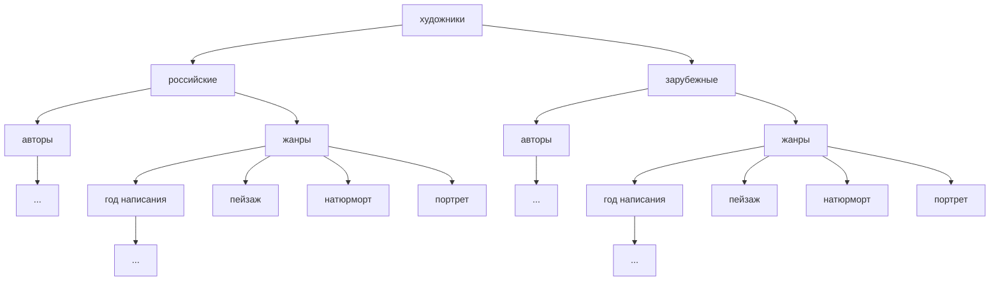
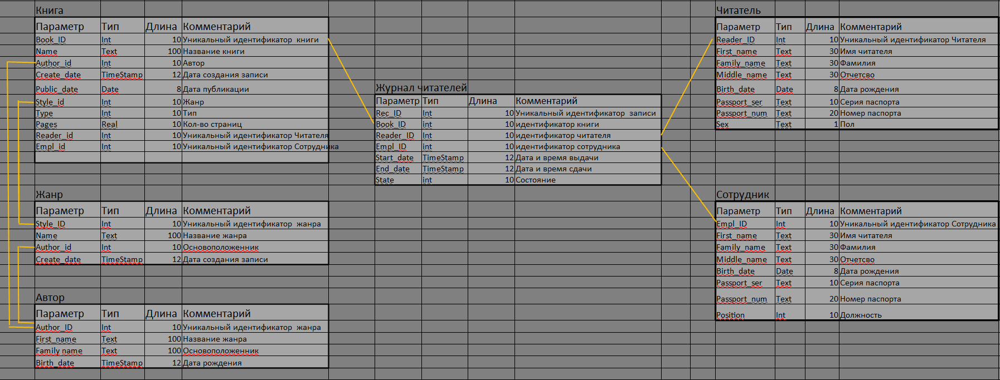

# БАЗЫ ДАННЫХ

<kbd>  </kbd>

`СУБД` это инструмент

Базы данных нужны для:
* хранения
* обработки
* быстрого извлечения

Пример **`иерархической модели хранения данных`**


**`Реляционные`** (relation - связь) базы данных - это бд, в которых данные распределены по отдельным, связанным мужду собой, таблицам.

**`SQL`** - особый язык программирования, который позволяет формулировать то, что нужно сделать с данными в таблицах.

ПРИМЕРЫ - пока используем **псевдокод**
___

SELECT * FROM Общий список

SELECT - "выбери"

\* - означает, что мы хотим видкть все столбцы

FROM - "из" - указываем, откуда необходимо выбрать инфрмацию

Общий список - название таблицы из нашего примера
___
SELECT ФИО, Тел, Комментарий

FROM Общий список
___
SELECT ФИО, Тел, Комментарий

FROM Общий список

WHERE статус = "холост"
___


* INNER JOIN
    
        INNER JOIN Люди, Телефоны
        ON id = Чей телефон

    ___
* LEFT JOIN

        LEFT JOIN Люди, Адреса_2
        ON id = Чей адрес

    ___
* RIGHT JOIN

        RIGHT JOIN Люди, Адреса_2
        ON id = Чей адрес

    ___
* FULL JOIN
___

Взаимотношения
* 1 к 1
* 1 ко многим
* многий ко многим
* многие к одному
___
### Пример связей в реляционной модели


```mermaid

```
